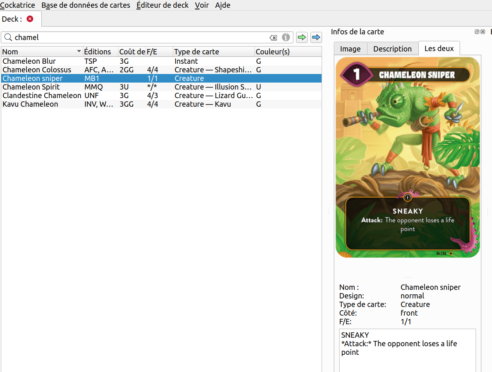

# Mind Bug in Cockatrice : *work in project* (Aug 2023)

This git repository hosts a small project I want to conclude in September 2023.
I tried (and purchased) recently the awesome small deck-building game « Mind Bug » (see [their cool website](https://mindbug.me/)), and I want to be able to play online.

The game is not available on BoardGameArena, I don't know how to develop games for BGA, and I like [Cockatrice](https://cockatrice.github.io/) to play Magic: the Gathering.

Cockatrice supports [custom sets](https://github.com/Cockatrice/Cockatrice/wiki/Custom-Cards-&-Sets), so why not design one myself for the Mind Bug game?

## Road map for the project

- [x] Create a first version of the [custom set .XML file](https://github.com/Cockatrice/Cockatrice/wiki/Custom-Cards-&-Sets), and sanitize/validate it.
- [x] Be able to load and use a custom card in a deck: okay!

- [ ] Scan all the remaining cards, cut the images to have square images (in French sadly) of the cards ;
- [ ] Add each card to the XML file ;
- [ ] Add each image to [this folder](https://perso.crans.org/besson/publis/Mind_Bug_cockatrice_custom_set_Aug2023.git/imgs/) on my website (so the images can be loaded from Internet when using a custom card) ;

- [ ] Be able to play alone (1 vs 1) to the Mind Bug game !

## I probably won't try to do this

- [ ] Publish this to the [Custom Card Databases by the Community](https://github.com/Cockatrice/Cockatrice/wiki/Custom-Cards-&-Sets#custom-card-databases-by-the-community) ?

## License ?

[MIT Licensed](LICENSE)
© Lilian Besson (Naereen), 2023
